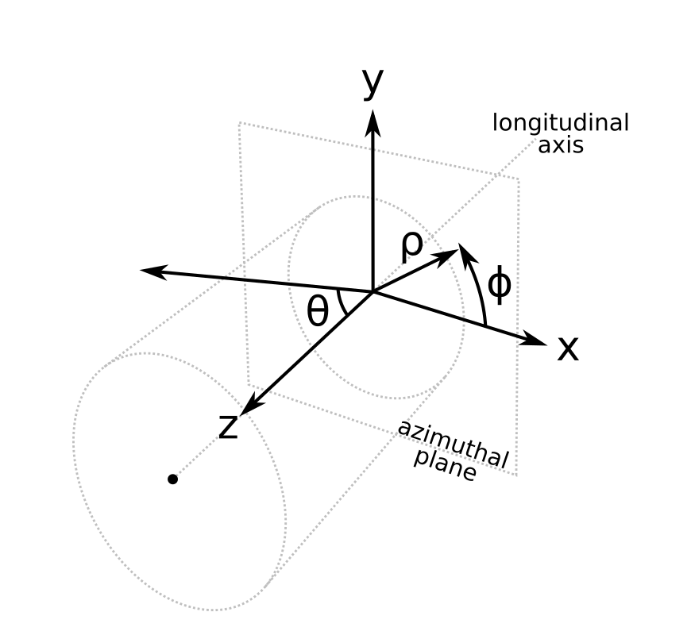

# Overview

[![Actions Status][actions-badge]][actions-link]
[![Documentation Status][rtd-badge]][rtd-link]
[![pre-commit.ci status][pre-commit-badge]][pre-commit-link]
[![codecov percentage][codecov-badge]][codecov-link]
[![GitHub Discussion][github-discussions-badge]][github-discussions-link]
[![Gitter][gitter-badge]][gitter-link]

[![PyPI platforms][pypi-platforms]][pypi-link]
[![PyPI version][pypi-version]][pypi-link]
[![Conda latest release][conda-version]][conda-link]
[![DOI][zenodo-badge]][zenodo-link]
[![LICENSE][license-badge]][license-link]
[![Scikit-HEP][sk-badge]][sk-link]

## Installation

You can install Vector with [pip](https://pypi.org/project/vector/) and [conda](https://anaconda.org/conda-forge/vector).

```bash
pip install vector
```

## Purpose of this library

Vector is a Python library for 2D and 3D spatial vectors, as well as 4D space-time vectors. It is especially intended for performing geometric calculations on _arrays of vectors_, rather than one vector at a time in a Python for loop. Vector is part of the [Scikit-HEP project](https://scikit-hep.org/), High Energy Physics (HEP) tools in Python.

Vectors may be expressed in any of these coordinate systems:

- the azimuthal plane may be Cartesian `x` `y` or polar `rho` ($\rho$) `phi` ($\phi$)
- the longitudinal axis may be Cartesian `z`, polar `theta` ($\theta$), or pseudorapidity `eta` ($\eta$)
- the temporal component for space-time vectors may be Cartesian `t` or proper time `tau` ($\tau$)

in any combination. (That is, 4D vectors have 2×3×2 = 12 distinct coordinate systems.)



Vectors may be included in any of these data types:

- `vector.obj` objects (pure Python)
- [NumPy structured arrays](https://numpy.org/doc/stable/user/basics.rec.html) of vectors
- [Awkward Arrays](https://awkward-array.org/) of vectors (possibly within variable-length lists or nested record structures)
- [SymPy expressions](https://www.sympy.org/en/index.html) for symbolic (non-numeric) manipulations

Each of these "backends" includes the same suite of functions.

## Getting help

- Source code on GitHub: [scikit-hep/vector](https://github.com/scikit-hep/vector)
- Report bugs and request features on the [GitHub Issues page](https://github.com/scikit-hep/vector/issues)
- Ask questions on the [GitHub Discussions page](https://github.com/scikit-hep/vector/discussions)
- Real-time chat on Gitter: [Scikit-HEP/Vector](https://gitter.im/Scikit-HEP/vector)

## Contributing to Vector

If you want to contribute to Vector, [pull requests](https://github.com/scikit-hep/vector/pulls) are welcome!

Please install the latest version of the `main` branch from source or a fork:

```bash
git clone https://github.com/scikit-hep/vector.git
cd vector
pip install -e .
```

Refer to [CONTRIBUTING.md](https://github.com/scikit-hep/vector/blob/main/.github/CONTRIBUTING.md) for more.

## Documentation

```{toctree}
src/talks.md
```

[actions-badge]: https://github.com/scikit-hep/vector/actions/workflows/ci.yml/badge.svg
[actions-link]: https://github.com/scikit-hep/vector/actions
[codecov-badge]: https://codecov.io/gh/scikit-hep/vector/branch/main/graph/badge.svg?token=YBv60ueORQ
[codecov-link]: https://codecov.io/gh/scikit-hep/vector
[conda-version]: https://img.shields.io/conda/vn/conda-forge/vector.svg
[conda-link]: https://github.com/conda-forge/vector-feedstock
[github-discussions-badge]: https://img.shields.io/static/v1?label=Discussions&message=Ask&color=blue&logo=github
[github-discussions-link]: https://github.com/scikit-hep/vector/discussions
[gitter-badge]: https://badges.gitter.im/Scikit-HEP/vector.svg
[gitter-link]: https://gitter.im/Scikit-HEP/vector?utm_source=badge&utm_medium=badge&utm_campaign=pr-badge&utm_content=badge
[license-badge]: https://img.shields.io/badge/License-BSD_3--Clause-blue.svg
[license-link]: https://opensource.org/licenses/BSD-3-Clause
[pre-commit-badge]: https://results.pre-commit.ci/badge/github/scikit-hep/vector/main.svg
[pre-commit-link]: https://results.pre-commit.ci/repo/github/scikit-hep/vector
[pypi-link]: https://pypi.org/project/vector/
[pypi-platforms]: https://img.shields.io/pypi/pyversions/vector
[pypi-version]: https://badge.fury.io/py/vector.svg
[rtd-badge]: https://readthedocs.org/projects/vector/badge/?version=latest
[rtd-link]: https://vector.readthedocs.io/en/latest/?badge=latest
[sk-badge]: https://scikit-hep.org/assets/images/Scikit--HEP-Project-blue.svg
[sk-link]: https://scikit-hep.org/
[zenodo-badge]: https://zenodo.org/badge/DOI/10.5281/zenodo.7054478.svg
[zenodo-link]: https://doi.org/10.5281/zenodo.7054478
